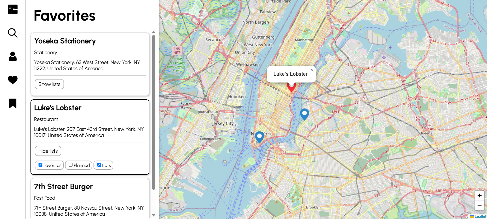

# fastapi-map

A FastAPI server managing JWT authentication, REST API calls, and CRUD operations, supporting a React frontend



---

## Features

- Interactive map – Look up locations an interactive map
- Authentication - Create an account with a username and password
- Custom lists – Create and manage lists to save and organize locations to

---

## Technologies & Implementation

- Frontend – Vite, React, and TypeScript
- Backend API – FastAPI
- Location Data – [Geoapify](https://www.geoapify.com/)
- Map Rendering – [Leaflet](https://leafletjs.com/)
- Authentication – JSON Web Tokens (JWT)
- Database Management – SQLAlchemy ORM

---

## Local Development

### Environment Variables
On the backend server, create a `.env` with the following contents:
```
SECRET_KEY="secret_key_here"
API_KEY="here_api_key_here"
```
On the frontend, create a `.env` with the following contents:
```
VITE_SERVER_API_URL="vite_server_api_url_here"
```

### Backend
1. Navigate to the backend directory
```
cd server
```
2. Create and activate a virtual environment
```
python -m venv venv
```
```
source venv/bin/activate    # on macOS and Linux
venv/Scripts/activate       # on Windows
```
3. Install dependencies
```
pip install -r requirements.txt
```
4. Run the server
```
uvicorn app.main:app --reload
```

### Frontend

1. Navigate to the frontend directory
```
cd frontend
```
2. Install dependencies & run app
```
npm install
npm run dev
```

---

## Testing

### Backend
1. Ensure current directory is the server directory
```
cd server
```
2. Run tests with pytest
```
cd tests
pytest -v
```

### Frontend
1. Ensure current directory is the frontend directory
```
cd frontend
```
2. Run tests
```
npm run test
```