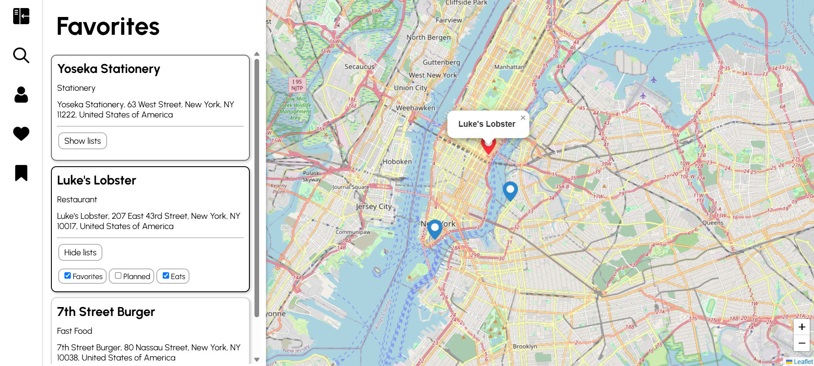

# fastapi-map

A FastAPI server managing JWT authentication, REST API calls, and CRUD operations, supporting a React frontend



---

## Features

- Interactive map – Look up locations an interactive map
- Authentication - Create an account with a username and password
- Custom Lists – Create and manage lists to save and organize locations to

---

## Technologies & Implementation

- Frontend – Vite, React, and TypeScript
- Backend API – FastAPI
- Location Data – [Geoapify](https://www.geoapify.com/)
- Map Rendering – [Leaflet](https://leafletjs.com/)
- Authentication – JSON Web Tokens (JWT)
- Database Management – SQLAlchemy ORM

---

## Server Endpoints

### Auth
```POST /register```: Register a new user account

```POST /token```: Log in and obtain an access token

```POST /verify-token```: Verify the validity of a user's JSON Web Token

### Lists
```GET /lists```: Retrieves all lists belonging to the authenticated user

```GET /lists/{list_id}```: Retrieves a single list

```POST /lists```: Create a list

```DELETE /lists/{list_id}```: Deletes a specific list

### Locations
```POST /lists/{list_id}/locations```: Adds a location to a list

```DELETE /lists/{list_id}/locations```: Deletes a location from a list

```GET /lists/check-location/{place_id}```: Check which lists contain a given location

### Search
```GET /searchQuery```: Search for locations using the Geoapify API

---

## Local Development

### Environment Variables
On the backend server, create a `.env` with the following contents:
```
SECRET_KEY="secret_key_here"
API_KEY="here_api_key_here"
```
On the frontend, create a `.env` with the following contents:
```
SERVER_API_URL="server_api_url_here"
```

### Backend
1. Navigate to the backend directory
```
cd server
```
2. Create and activate a virtual environment
```
python -m venv venv
```
```
source venv/bin/activate    # on macOS and Linux
venv/Scripts/activate       # on Windows
```
3. Install dependencies
```
pip install -r requirements.txt
```
4. Run the server
```
uvicorn app.main:app --reload
```

### Frontend

1. Navigate to the frontend directory
```
cd client
```
2. Install dependencies & run app
```
npm install
npm run dev
```